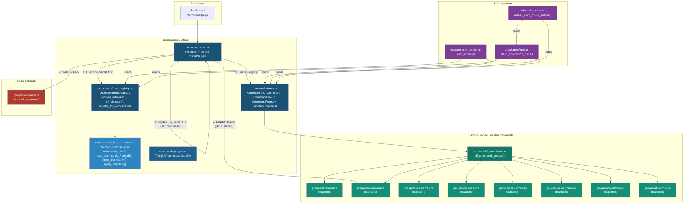

# Command Dispatch Architecture

**Last updated:** 2026-06-16
**Branch:** `release/v0.8.60` (HEAD at `6175b7cf`)
**Related EPIC:** [EPIC-001 — Command Dispatch and Ownership Refactor](https://github.com/Hmbown/CodeWhale/issues/2870)
**Related issue:** [Command refactor](https://github.com/Hmbown/CodeWhale/issues/2791)

## Overview

This document describes the final command dispatch architecture after Layers 4-5
landed and migration scaffolding was cleaned up. It serves as the single source
of truth for module boundaries, interface contracts, and cross-references to
landed layers.

## Architecture Diagram



## Dispatch Flow (Precedence Order)

The `execute()` function in `commands/mod.rs` follows this strict precedence:

| Step | Stage | Handler | Details |
|------|-------|---------|---------|
| 1 | **User-defined commands** | `user_registry::try_dispatch()` | Highest precedence. User markdown commands (`.md` files in workspace `~/.codewhale/commands/` or `~/.deepseek/commands/` paths) override any built-in with the same name. Checks load errors (invalid frontmatter, empty body) and returns error messages. |
| 2 | **Legacy backward-compatible aliases** | `groups::config::dispatch()` | `/jihua` → `/mode plan`, `/zidong` → `/mode yolo`. Permanent aliases predating the group-owned structure. Documented at `commands/mod.rs` lines 140-149. |
| 3 | **Built-in command registry** | `registry().get()` → `command_object.execute()` | All registered built-in commands from 8 group-owned areas, resolved by canonical name or alias. Metadata defined in static `CommandInfo` constants per group. |
| 4 | **Legacy migration hints** | `commands/mod.rs` match arms | `/set` and `/deepseek` return explanatory error messages pointing to the replacement commands. Deliberately excluded from the registry and autocomplete. |
| 5 | **Skills fallback** | `groups::skills::run_skill_by_name()` | Lowest precedence. If no native or user command matches, a skill whose name matches the command is attempted. Falls through to unknown-command suggestions. |

## Module Boundaries

### `commands/mod.rs` — Central dispatch gate

- **Role:** Entry point for all slash command execution.
- **Public API:**
  - `execute(cmd: &str, app: &mut App) -> CommandResult` — main dispatch
  - `registry() -> &'static CommandRegistry` — initialized once via `OnceLock`
  - `command_infos() -> Vec<&'static CommandInfo>` — all registered metadata
  - `get_command_info(name: &str) -> Option<&'static CommandInfo>` — lookup by name/alias
  - `set_config_value()` / `switch_mode()` — utility functions for UI views
- **Owns:** Registry construction (`build_registry()`), dispatch precedence, unknown-command suggestions, edit distance scoring.
- **Landed:** Layer 1 (PR #2871), Layer 3 (PR #2888)

### `commands/traits.rs` — Command traits and registry

- **Role:** Defines command metadata, trait objects, and the central registry.
- **Key types:**
  - `CommandInfo` — static metadata: name, aliases, usage, `description_id` (MessageId)
  - `Command` trait — `info()`, `execute(app, args)`
  - `CommandGroup` trait — `commands() -> Vec<Box<dyn Command>>`
  - `FunctionCommand` — concrete `Command` wrapping a function pointer
  - `CommandRegistry` — stores commands and name→index lookup, supports `get()`, `get_info()`, `register_group()`, `infos()`, `iter()`
- **Landed:** Layer 3 (PR #2888)

### `commands/user_registry.rs` — User command boundary

- **Role:** Dedicated registry for user-defined markdown slash commands.
- **Key types:**
  - `UserCommandMetadata` — name, body, description, argument_hint, allowed_tools, pausable, aliases, hidden
  - `UserCommandRegistry` — `HashMap<String, UserCommandMetadata>` for commands and aliases
  - `LoadError` — path + message for error tracking
- **Public API:**
  - `ensure_initialized(workspace)` / `reload(workspace)` — lazy init
  - `try_dispatch(app, input) -> Option<CommandResult>` — dispatch path
  - `registry_for_workspace(workspace) -> UserCommandRegistry` — retrieval
  - `current_registry() -> UserCommandRegistry` — snapshot
- **Integration:** Palette filtering (`command_palette.rs`), slash completion shadowing logic (`widgets/mod.rs`).
- **Landed:** Layer 5 (FEAT-002, PR TBD)

### `commands/user_commands.rs` — Permanent lower-level scanning/parsing

- **Role:** Permanent lower-level file scanning and frontmatter parsing for user commands.
- **Key functions:**
  - `commands_dirs(workspace) -> Vec<PathBuf>` — 6 directories in precedence order
  - `load_commands_from_dir(dir) -> Vec<(String, String)>` — scans `.md` files
  - `parse_frontmatter(content) -> (Vec<(String, String)>, &str)` — YAML-like metadata
  - `parse_allowed_tools(value) -> Vec<String>` — tool list parsing
  - `apply_template(template, args) -> String` — `$ARGUMENTS` / `$1`, `$2` substitution
  - `try_dispatch_user_command()` — `#[cfg(test)]` only (deferred migration)
  - `load_user_commands()` — `#[cfg(test)]` only (deferred migration)
- **Status:** Permanent. Consumed by `user_registry.rs`. Not removable.
- **Deferred cleanup:** The `#[cfg(test)]` functions `try_dispatch_user_command()` and `load_user_commands()` have ~15 dependent tests that should be migrated to `user_registry` APIs. Tracked in [deferred-items-tracking.md](MemoryBank link).

### `commands/groups/` — Group-owned built-in command areas

Each group module registers `CommandGroup` implementations and provides a `dispatch()` function.

| Group | File | Commands | Key Aliases |
|-------|------|----------|-------------|
| **core** | `groups/core/mod.rs` | anchor, help, clear, exit, model, models, provider, queue, stash, hooks, subagents, agent, swarm, links, feedback, hf, home, workspace, profile, rlm, translate, voice, voicesend, voicecontrol | `?`, `q`, `cwd`, `dashboard`, `huggingface`, bilingual Chinese aliases |
| **config** | `groups/config/mod.rs` | config, sidebar, settings, status, statusline, mode, theme, verbose, trust, logout, slop | `experiments`, `xinren`, `jihua`, `zidong`, `canzha` |
| **session** | `groups/session/mod.rs` | rename, save, fork, new, sessions, load, compact, purge, relay, export | `gaiming`, `chongmingming`, `branch`, `resume`, `jiazai`, `yasuo`, `qingchu`, `batonpass`, `接力`, `daochu` |
| **skills** | `groups/skills/mod.rs` | skills, skill, review, restore | `jinengliebiao`, `jineng`, `shencha` |
| **debug** | `groups/debug/mod.rs` | tokens, cost, balance, cache, change, system, context, edit, diff, undo, retry | `xitong`, `ctx`, `chongshi` |
| **memory** | `groups/memory/mod.rs` | note, memory | — |
| **project** | `groups/project/mod.rs` | init, lsp, share, goal | `hunt`, `mubiao`, `狩猎` |
| **utility** | `groups/utility/mod.rs` | attach, task, jobs, mcp, network, plugins | `image`, `media`, `fujian`, `tasks`, `job`, `zuoye`, `plugin` |

Each group follows the same pattern:
1. Static `CommandInfo` constants for metadata.
2. `CommandGroup` impl returning registered commands.
3. `dispatch()` function routing command names to handler functions.
4. Handler functions call existing per-command implementation files (e.g., `core::help()`).

**Landed:** Layer 4 (FEAT-001, PR TBD)

### `commands/plugins.rs` — Plugin command handler

- **Role:** `/plugins` slash command for listing and inspecting script plugin tools.
- **Status:** Standalone handler, registered in `groups/utility/commands`. Not a bridge or migration artifact.

## UI Integration Points

### Command Palette (`tui/command_palette.rs`)

- `build_entries()` builds palette entries from:
  1. **Built-in commands** — `commands::command_infos()`, skipping any shadowed by user commands.
  2. **User commands** — `user_registry::iter()`, filtering out hidden commands.
  3. Skills and tools (non-command entries).
- Palette entries include label, description, command text, and action type (execute directly or insert text with cursor position).
- **Landed:** Layer 5 (FEAT-002) integrated user command shadowing for palette entries.

### Slash Completion (`tui/slash_menu.rs` + `tui/widgets/mod.rs`)

- `slash_completion_hints()` generates autocomplete entries for the input line.
- Completion logic:
  1. Prefix matching (starts-with, highest priority)
  2. Contains/substring matching (medium priority)
  3. Fuzzy character-order matching (lowest priority)
- Shadowing logic (`builtin_visible_for_completion_match()`):
  - If a user command shadows the canonical built-in name → hide built-in entirely.
  - If only an alias is shadowed but the canonical name matches → keep built-in visible.
  - If matching through a shadowed alias → hide that specific path.
- Skills appear only after `/skill ` prefix is typed.
- `/model` shows model-specific completions for the current provider.
- **Landed:** Layer 5 (FEAT-002) integrated user command shadowing for slash completion.

## Permanent Exceptions

The following artifacts are permanently kept and documented with in-code comments
referencing the FEAT-003 planning documentation:

| Artifact | File | Rationale |
|----------|------|-----------|
| `"jihua"` / `"zidong"` legacy aliases | `commands/mod.rs:140-149` | Backward-compatible `/mode` aliases predating group dispatch. |
| `"set"` / `"deepseek"` migration hints | `commands/mod.rs:158-164` | Deliberately excluded from registry/autocomplete; return explanatory errors. |
| `user_registry::load()` → `user_commands::commands_dirs()` | `user_registry.rs:57` | Lower-level scanning/parsing dependency, not a bridge. |
| `#[allow(clippy::module_inception)]` × 6 | `groups/{config,core,debug,memory,session,skills}/mod.rs` | Standard Rust structural pattern for group dirs sharing a name with a submodule. |
| `user_commands.rs` as permanent lower layer | `user_commands.rs` module doc | Provides shared file I/O, frontmatter parsing, and template support consumed by `UserCommandRegistry`. |
| `try_dispatch_user_command()` / `load_user_commands()` (`#[cfg(test)]`) | `user_commands.rs` | Deferred test migration — see `deferred-items-tracking.md`. |

## Test and Evidence Matrix

| Category | Scope | Test Prefix | Count (baseline) |
|----------|-------|-------------|-------------------|
| Built-in dispatch | Central `execute()`, group dispatch, handler correctness | `commands::` | 446 |
| Command palette | Palette entries, shadowing, user commands | `command_palette` | 18 |
| Slash completion | Completion hints, shadowing, aliases, skills | `slash_completion` | 17 |
| User registry | Loading, metadata, aliases, deduplication, error paths | `user_registry::tests::` | (included in 446) |
| Parser and registry | Registry construction, lookup, uniqueness | `commands::tests::` | (included in 446) |

## Landed Layer References

| Layer | Feature | PR/Issue | Description |
|-------|---------|----------|-------------|
| Layer 1 | — | PR #2871 | Command-surface cleanup and neutral shared extraction |
| Layer 2 | — | PR #2878 | Command parity harness |
| — | — | PR #2887 | Supporting acceptance-test harness |
| Layer 3 | — | PR #2888 | Registry and parser helper extraction |
| Layer 4 | FEAT-001 | — | Group-owned built-in command files under `commands/groups/` |
| Layer 5 | FEAT-002 | — | Dedicated `UserCommandRegistry` boundary with dispatch/palette/completion |
| Layer 6 | FEAT-003 | — | Completion cleanup, full validation, architecture documentation |

## Issue Closure Sequencing

| Issue | Status | Closure Condition |
|-------|--------|-------------------|
| [#2870](https://github.com/Hmbown/CodeWhale/issues/2870) | Open | Updated with final layer status after Layer 6 validation. |
| [#2791](https://github.com/Hmbown/CodeWhale/issues/2791) | Open | Closed only after: (1) Layer 6 full workspace validation passes, (2) central architecture doc updated, (3) any residual follow-up moved to separate issue(s). |

## Validation Evidence (Template)

```powershell
# Cargo checks
cargo fmt --all -- --check
cargo check -p codewhale-tui
cargo clippy -p codewhale-tui -- -D warnings

# Command-specific tests
cargo test -p codewhale-tui commands::
cargo test -p codewhale-tui command_palette
cargo test -p codewhale-tui slash_completion

# Full workspace validation
cargo test --workspace
```

## Related Documents

- [ARCHITECTURE.md](../../docs/ARCHITECTURE.md) — overall system architecture
